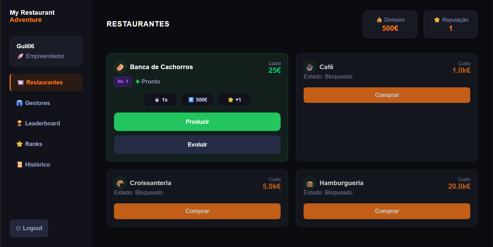
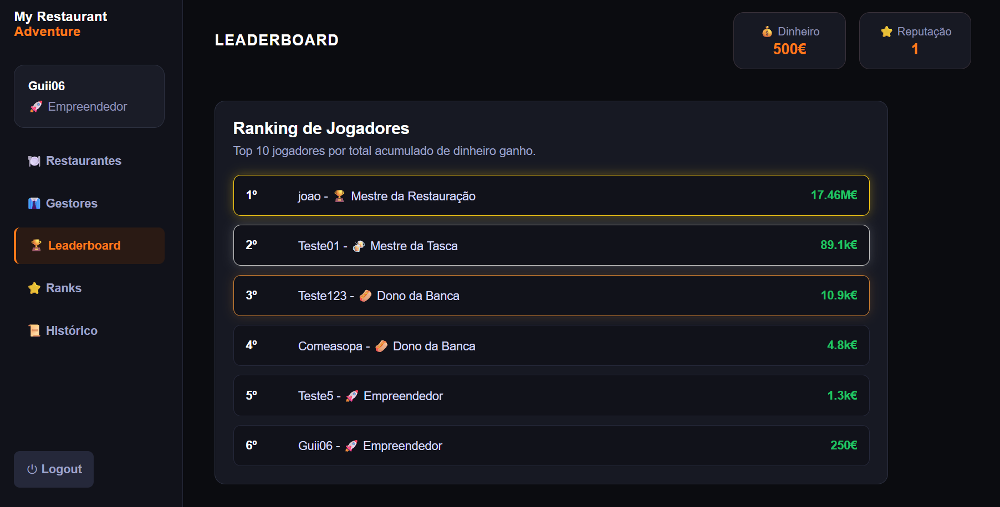
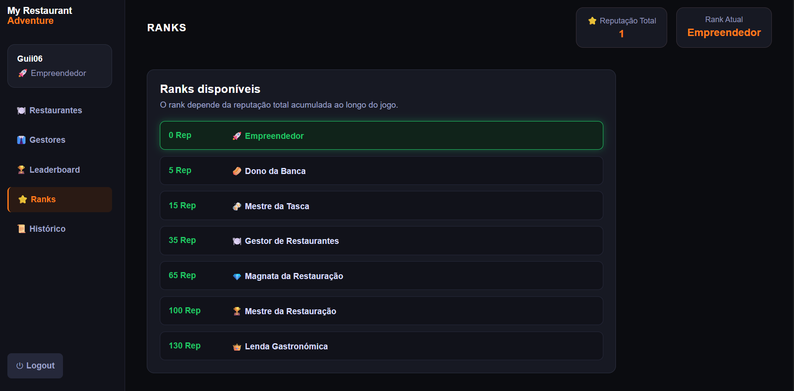

# My Restaurant Adventure

**My Restaurant Adventure** is a full-stack web resource management game developed with **Flask**, **SQLite**, **HTML**, **CSS** and **JavaScript**.

The project was developed as part of the **Web Application Development curricular unit (DAW)** in the **Bachelor's Degree in Management Information Systems** at **Instituto Politécnico de Setúbal**.

The player can create an account, log in, buy restaurants, manage money and reputation, start timed productions, collect profits, upgrade businesses, hire managers, unlock ranks and compete on a leaderboard.

The application follows a simple structure inspired by the **MVC pattern**, separating backend logic, database operations, templates and static frontend files.

---

## Project Overview

The main goal of the game is to expand a restaurant business empire by managing resources efficiently.

During the game, the player can:

* Create an account;
* Log in and log out;
* Buy restaurants;
* Wait for restaurant construction;
* Start timed productions;
* Follow progress bars;
* Collect profits manually;
* Upgrade restaurants;
* Hire managers;
* Gain reputation;
* Unlock ranks;
* Check the leaderboard;
* Check the action history.

---

## Screenshots

### Dashboard



### Leaderboard



### Ranks



---

## Technologies Used

### Backend

* Python
* Flask
* Flask-Login
* SQLite

### Frontend

* HTML5
* CSS3
* JavaScript
* Fetch API

### Tools

* Git
* GitHub
* Visual Studio Code

---

## Main Features

### User System

* User registration;
* User login;
* User logout;
* Session management with Flask-Login;
* Protected pages using authentication;
* Password hashing with Werkzeug security functions.

### Restaurant Management

* Restaurant purchase system;
* Fixed restaurants used as construction slots;
* Timed construction;
* Timed production;
* Manual profit collection;
* Timed restaurant upgrades;
* Cost, profit and reward calculation based on restaurant level.

### Available Restaurants

The game uses fixed restaurant types as progression slots. Each restaurant has its own cost, construction time, production time, base profit and reputation rewards.

Available restaurants:

* Banca de Cachorros;
* Café;
* Croissanteria;
* Hamburgueria.

Each restaurant can have different states:

* Locked;
* Building;
* Ready;
* Producing;
* Completed;
* Upgrading.

### Manager System

* Each restaurant has an associated manager;
* A manager can be hired after the restaurant is unlocked;
* Hiring a manager requires both money and reputation;
* Managers automatically restart production after the player collects profit;
* Profit collection remains manual.

### Progression System

* Reputation system;
* Lifetime reputation tracking;
* Rank system based on total accumulated reputation;
* Notification when the player reaches a new rank;
* Page listing all available ranks;
* Current rank displayed in the sidebar and leaderboard.

### Leaderboard

* Global player leaderboard;
* Ranking based on total accumulated money earned;
* Top 10 players displayed;
* Visual highlight for the top three positions;
* Data loaded dynamically using Fetch API;
* Each player is displayed with their current rank and rank icon.

### Action History

* Records the player's main actions;
* Displays the most recent actions;
* Stores action messages with date and time;
* Includes purchases, profit collection, upgrades and manager hiring.

### Interface

* Main dashboard;
* Managers page;
* Leaderboard page;
* Ranks page;
* Action history page;
* Temporary success and error messages;
* Confirmation modal for important actions;
* Progress bars for construction, production and upgrades;
* Scroll position preservation after dashboard actions;
* Responsive layout for different screen sizes.

---

## Project Structure

```text
my-restaurant-adventure/
├── models/
│   ├── database.py
│   └── user.py
├── static/
│   ├── scripts/
│   │   └── main.js
│   └── styles/
│       └── style.css
├── templates/
│   ├── dashboard.html
│   ├── history.html
│   ├── layout.html
│   ├── leaderboard.html
│   ├── login.html
│   ├── managers.html
│   ├── ranks.html
│   └── register.html
├── docs/
│   └── screenshots/
│       ├── dashboard.png
│       ├── leaderboard.png
│       └── ranks.png
├── server.py
├── views.py
├── settings.py
├── requirements.txt
├── api_documentacao.md
├── base_dados.sql
├── .gitignore
└── README.md
```

---

## Installation

### 1. Clone the repository

```bash
git clone https://github.com/Guii-06/my-restaurant-adventure.git
```

```bash
cd my-restaurant-adventure
```

### 2. Create a virtual environment

```bash
python -m venv .venv
```

### 3. Activate the virtual environment

On Windows PowerShell:

```bash
.\.venv\Scripts\Activate.ps1
```

On macOS/Linux:

```bash
source .venv/bin/activate
```

### 4. Install dependencies

```bash
pip install -r requirements.txt
```

If `requirements.txt` is not available, install the dependencies manually:

```bash
pip install flask flask-login
```

---

## Running the Application

Start the Flask server:

```bash
python server.py
```

Then open the application in the browser:

```text
http://127.0.0.1:8080
```

---

## Database

The application uses **SQLite**.

The database is created automatically when the project runs through the `Database` class located in:

```text
models/database.py
```

The main database tables are:

* `USER`;
* `BUSINESS_TYPE`;
* `USER_BUSINESS`;
* `ACTION_HISTORY`.

### Table Purpose

| Table            | Purpose                                                                                             |
| ---------------- | --------------------------------------------------------------------------------------------------- |
| `USER`           | Stores registered users, authentication data, money, reputation and accumulated progression values. |
| `BUSINESS_TYPE`  | Stores the fixed restaurant types available in the game.                                            |
| `USER_BUSINESS`  | Stores the restaurants purchased by each player, including level, state, manager and timers.        |
| `ACTION_HISTORY` | Stores the most recent actions performed by each player.                                            |

The `BUSINESS_TYPE` table stores the fixed restaurants of the game, while `USER_BUSINESS` stores the restaurants owned by each player.

The SQL schema is also documented in:

```text
base_dados.sql
```

---

## API

The project includes one JSON API route used by the leaderboard.

### GET `/api/leaderboard`

Returns the top 10 players ordered by total accumulated money earned.

This route is used by the frontend through the Fetch API.

Example response:

```json
[
  {
    "position": 1,
    "username": "Guii06",
    "total_earned": 100300,
    "rank_name": "Mestre da Tasca",
    "rank_icon": "🍻"
  }
]
```

More details are available in:

```text
api_documentacao.md
```

---

## Security and Validations

The project includes several backend validations to prevent invalid actions, such as:

* Accessing protected pages without being logged in;
* Buying restaurants that do not exist;
* Producing with restaurants that do not belong to the logged user;
* Collecting profit from another user's restaurant;
* Upgrading another user's restaurant;
* Buying managers for another user's restaurant;
* Registering or logging in with empty fields;
* Buying the same restaurant more than once;
* Upgrading restaurants above the maximum level.

Passwords are stored using hashes generated with Werkzeug security functions.

SQL queries use parameterized values, reducing the risk of SQL injection.

---

## Technical Notes

This project was developed for an academic environment and is not intended to be production-ready.

Some improvements that could be implemented in a future version include:

* Using POST instead of GET for actions that modify data;
* Adding CSRF protection;
* Moving business logic into a separate service layer;
* Using SQLAlchemy instead of direct SQLite queries;
* Using environment variables for sensitive configuration values;
* Improving template inheritance to reduce repeated HTML;
* Adding automated tests.

---

## Authors

Academic project submitted by:

* Guilherme Monteiro
* António Henriques
* Gonçalo Gouveia

Main implementation and technical integration led by Guilherme Monteiro.

---

## AI Assistance

AI tools were used as support during the development process, mainly for debugging, code review, documentation improvement and learning assistance.

The project was tested, adapted and integrated by the main implementer to ensure understanding, functionality and consistency with the academic requirements.

---

## License

This project was developed for academic and portfolio purposes.


